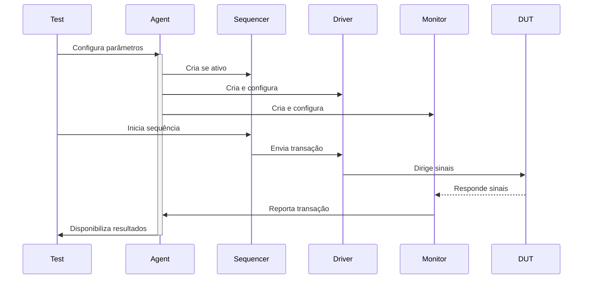

# SPI UVM Agent Documentation

## 📌 Overview
O `spi_agent` é o componente central do ambiente UVM, responsável por:
- Gerenciar a comunicação entre sequenciador, driver e monitor
- Configurar o modo de operação (Master/Slave)
- Atuar como interface entre o ambiente de teste e o DUT

## 🧩 Componentes do Agent
| Componente     | Descrição                                  | Modo Ativo | Modo Passivo |
|----------------|-------------------------------------------|------------|--------------|
| `driver`       | Dirige transações para a interface SPI    | ✓          | ✗            |
| `monitor`      | Captura transações da interface SPI       | ✓          | ✓            |
| `sequencer`    | Gera sequências de transações             | ✓          | ✗            |
| `analysis_port`| Saída para scoreboard e cobertura         | ✓          | ✓            |

## ⚙️ Configuração
### Parâmetros de Configuração
| Parâmetro    | Tipo | Valores         | Descrição                          |
|-------------|------|-----------------|-----------------------------------|
| `is_active` | bit  | UVM_ACTIVE(1)   | Habilita driver e sequenciador    |
|             |      | UVM_PASSIVE(0)  | Modo somente monitoração          |
| `mode`      | bit  | 0 (Slave)       | Modo de operação do dispositivo   |
|             |      | 1 (Master)      |                                   |

### Exemplo de Configuração
```systemverilog
// No ambiente de teste
function void my_test::build_phase(uvm_phase phase);
    super.build_phase(phase);
    uvm_config_db#(bit)::set(this, "env.agent", "is_active", UVM_ACTIVE);
    uvm_config_db#(bit)::set(this, "env.agent", "mode", 1);
endfunction
```
## 📋 Código Principal
### Estrutura do Agent
```systemverilog
class spi_agent extends uvm_agent;
    // Componentes
    spi_driver    driver;     // Instância do driver
    spi_monitor   monitor;    // Instância do monitor
    uvm_sequencer #(spi_transaction) sequencer; // Sequenciador
    
    // Interface de análise
    uvm_analysis_port #(spi_transaction) analysis_port;
    
    // Configurações
    bit is_active = UVM_ACTIVE;
    bit mode;  // 0: Slave, 1: Master
endclass
```
### Fases UVM
#### 1. Build Phase
```systemverilog
virtual function void build_phase(uvm_phase phase);
    // Cria componentes ativos se necessário
    if(is_active) begin
        sequencer = uvm_sequencer#(spi_transaction)::type_id::create("sequencer", this);
        driver = spi_driver::type_id::create("driver", this);
    end
    
    // Monitor sempre é criado
    monitor = spi_monitor::type_id::create("monitor", this);
endfunction
```
#### 2. Connect Phase
```systemverilog
virtual function void connect_phase(uvm_phase phase);
    // Conecta driver ao sequenciador
    if(is_active) begin
        driver.seq_item_port.connect(sequencer.seq_item_export);
    end
    
    // Conecta monitor ao analysis port
    monitor.mon_ap.connect(analysis_port);
endfunction
```
## 🔄 Fluxo de Operação

## 💡 Melhores Práticas
### 1. Modo de Operação:
```systemverilog
// Para configuração como Slave
uvm_config_db#(bit)::set(this, "agent", "mode", 0);
```
### 2. Controle de Atividade:
```systemverilog
// Para modo passivo (somente monitoração)
agent.set_active(UVM_PASSIVE);
```
### 3. Conexão de Análise:
```systemverilog
// No ambiente
function void connect_phase(uvm_phase phase);
    agent.analysis_port.connect(scoreboard.analysis_export);
    agent.analysis_port.connect(coverage.analysis_export);
endfunction
```
## 🚨 Debug Comum
| Sintoma    | Causa Provável | Solução                         |
|-------------|------|-----------------------------------|
| Transações não geradas	 | Agent em modo PASSIVE	  | Verificar is_active    |
|  Dados invertidos	  |  Modo Master/Slave incorreto	    | Checar configuração mode          |
| Sem comunicação	     | Interface não conectada	  | Verificar uvm_config_db |
