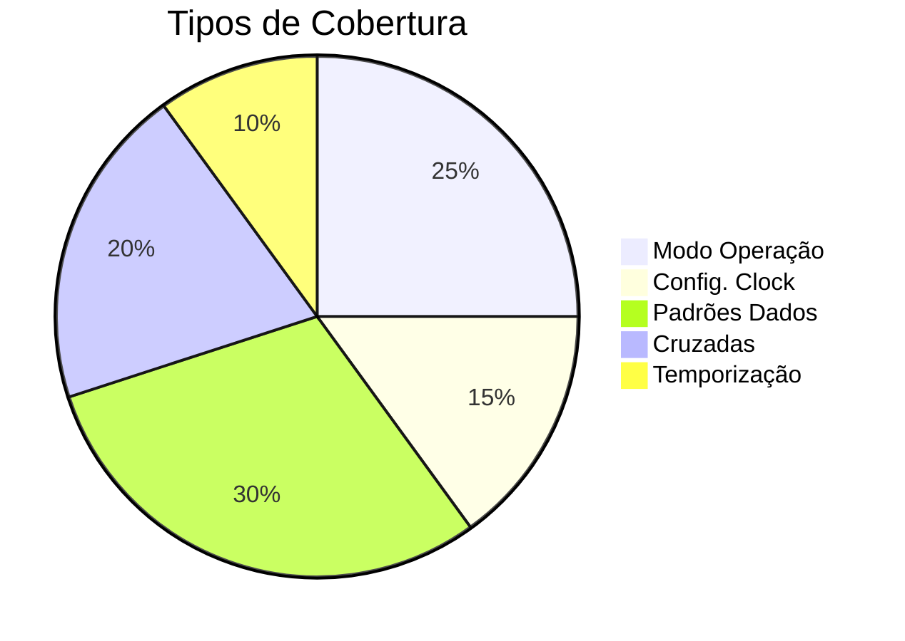

# SPI UVM Coverage Documentation


## 📌 Visão Geral
O componente `spi_coverage` implementa a cobertura funcional para o ambiente de verificação SPI, garantindo que todos os cenários críticos sejam testados.

## 🧩 Recursos Principais
- ✅ Cobertura de modos Master/Slave
- ✅ Análise de configurações de clock
- ✅ Verificação de padrões de dados
- ✅ Cobertura cruzada modo/dados
- ✅ Detecção de condições de erro
- ✅ Análise de temporização

## ⚙️ Estrutura de Cobertura

## 📋 Tabela de Coverpoints
| Coverpoint               | Bins                                  | Descrição | 
|----------------------|-----------------------------------------|-----------|
|`cp_mode` |	Master, Slave |	Modo de operação | 
|`cp_clock_div` | 	Low/Mid/High | Divisor de clock | 
|`cp_data` | 	00, FF, 01-7F, 80-FE | 	Dados transmitidos | 
|`cp_data_transfer` | 	00, FF, 01-7F, 80-FE | 	Dados recebidos | 
|`cross_mode_data` | 	Combinações modo x dados | 	Cobertura cruzada | 
|`cp_duration` | 	Short/Medium/Long | 	Duração das transações | 
|`cp_errors` | 	Timeout, Invalid Register | 	Condições de erro | 

## 💡 Exemplo de Uso
```systemverilog
// No ambiente
function void spi_env::connect_phase(uvm_phase phase);
    agent.analysis_port.connect(coverage.analysis_export);
endfunction

// Resetar cobertura durante teste
task my_test::run_phase(uvm_phase phase);
    coverage.reset();
    // ... resto do teste ...
endtask
```
## 📈 Relatório de Exemplo
```log
COVERAGE REPORT:

CP_MODE:
    Master: 45 hits
    Slave:  55 hits
    
CP_DATA:
    00:     10 hits
    FF:     12 hits
    01-7F: 38 hits
    80-FE: 40 hits
    
CROSS_MODE_DATA:
    Master x 00:  5 hits
    Master x FF:  7 hits
    Slave x 00:   5 hits
    // ...
    
Total Coverage: 92.5%
```
## 🛠 Integração Avançada
### Adicionar Novos Coverpoints
```systemverilog
covergroup extended_cg;
    // Novo coverpoint para paridade
    cp_parity: coverpoint tr.parity {
        bins even = {0};
        bins odd = {1};
    }
endgroup
```
### Configuração de Thresholds
```systemverilog
// No teste
initial begin
    uvm_top.set_coverage_level(UVM_FULL);
    spi_cg.set_inst_name("SPI_Coverage");
    spi_cg.set_weight(50); // Prioridade relativa
end
```
