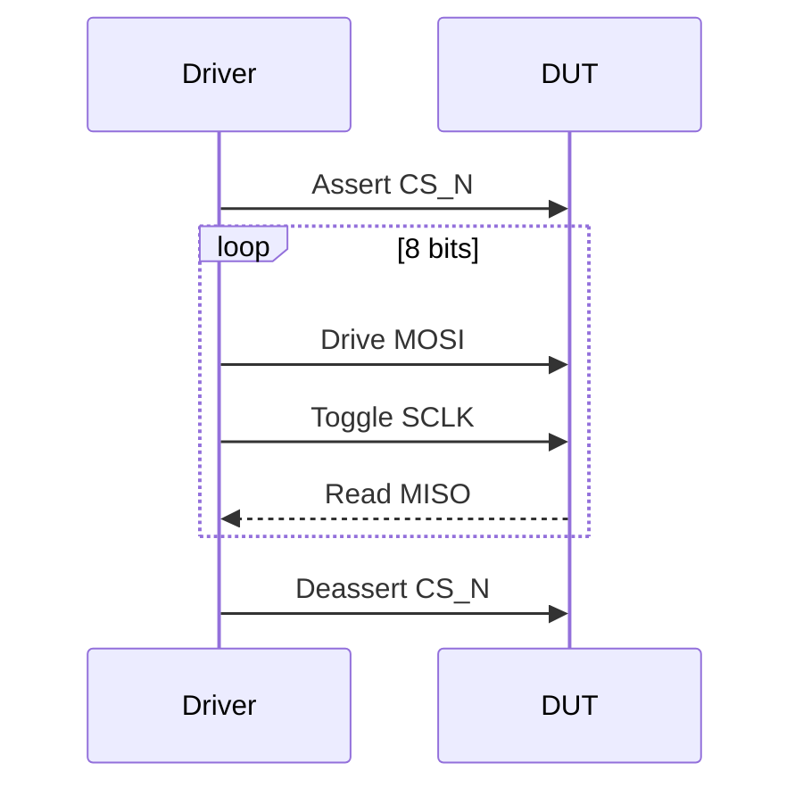
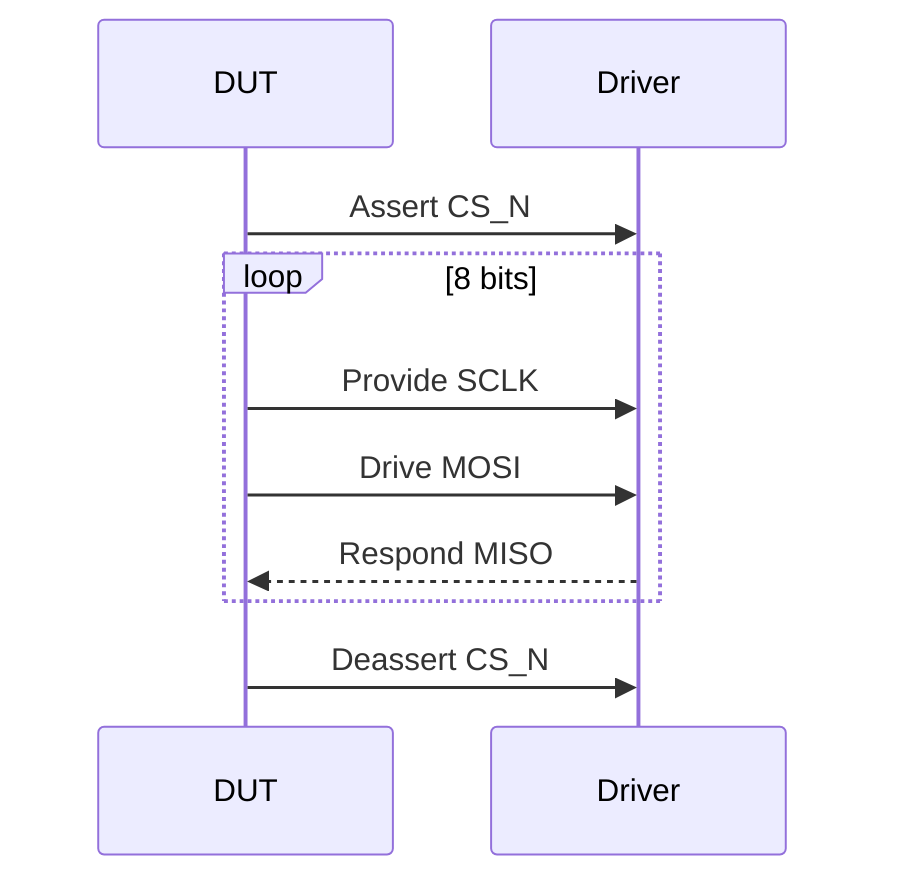

# UVM SPI Driver & Testbench Environment


## 📌 Overview
Este projeto implementa um ambiente de verificação UVM para um controlador SPI (Serial Peripheral Interface), com driver configurável para operação Master/Slave. O ambiente inclui componentes UVM completos para validação do protocolo SPI.

## 🚀 Features
- **Dual Mode Operation**: Suporte completo para modo Master e Slave
- **Register Configuration**: Interface para leitura/escrita de registradores
- **Clock Control**: Divisor de clock programável
- **Data Order**: Suporte a MSB-first e LSB-first
- **Auto-checking**: Scoreboard integrado para verificação automática
- **Functional Coverage**: Cobertura de modos e transações

## 🧩 Componentes UVM
| Componente          | Descrição                                  |
|---------------------|--------------------------------------------|
| `spi_transaction`   | Item de transação com dados e configuração |
| `spi_driver`        | Driver bidirecional Master/Slave          |
| `spi_monitor`       | Monitor de transações SPI                 |
| `spi_agent`         | Agente UVM com sequenciador               |
| `spi_scoreboard`    | Verificador de integridade de dados       |
| `spi_env`           | Ambiente top-level UVM                   |
| `spi_test`          | Casos de teste base                      |

## 📋 Driver Operation
### Fluxo Master Mode

### Fluxo Slave Mode

## 🔧 Interface Signals
```systemverilog
interface spi_interface(input logic clk);
  logic       reset_n;
  logic       cs_n;
  logic       mosi;
  logic       miso;
  logic       sclk;
  logic       mode;
  logic [7:0] reg_addr;
  logic       reg_write;
  logic [7:0] reg_wdata;
  logic [7:0] reg_rdata;
  logic       ready;
endinterface
```
## 🛠 Integração
### 1. Conexão da Interface
```systemverilog
module top;
  spi_interface intf(clk);
  spi_dut dut(.intf(intf));
  
  initial begin
    uvm_config_db#(virtual spi_interface)::set(null, "*", "vif", intf);
    run_test("spi_test");
  end
endmodule
```
### 2. Exemplo de Transação
```systemverilog
class spi_example_seq extends uvm_sequence #(spi_transaction);
  task body();
    `uvm_do_with(req, {
      mode == UVM_SPI_MASTER;
      clock_div == 4;
      data == 8'hA5;
      lsb_first == 0;
    })
  endtask
endclass
```
## ⚙️ Register Configuration
### Register Map Table

| Register      | Address | Bits | Description                                     |
|---------------|---------|------|-------------------------------------------------|
| `ctrl_reg`    | 0x00    | [0]: enable, [1]: mode, [2]: lsb_first	| Control register to configure SPI parameters (master/slave, data order, etc.) |
| `clk_div_reg` | 0x10    | [7:0] | Clock divider register to set the SPI clock frequency |
## 📊 Exemplo de Saída
```log
UVM_INFO @ 0ns: Driver [SPI_DRV] Starting MASTER transaction
  Mode: MASTER | Data: 0xA5 | Clock Div: 4 | LSB First: 0

UVM_INFO @ 1200ns: Monitor [SPI_MON] Transaction completed
  TX: 0xA5 | RX: 0xC3 | Status: OK | Duration: 1.2us

UVM_INFO @ 1200ns: Scoreboard [SPI_SB] Data match successful
```
