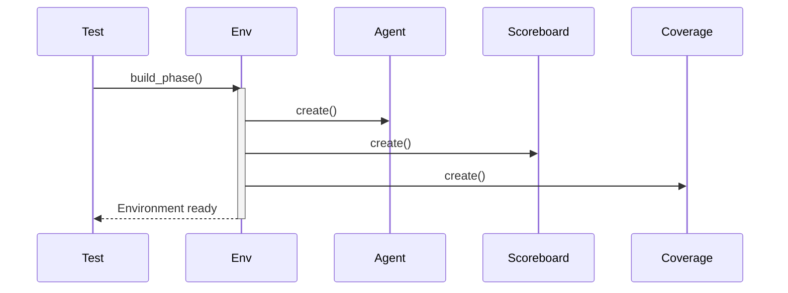
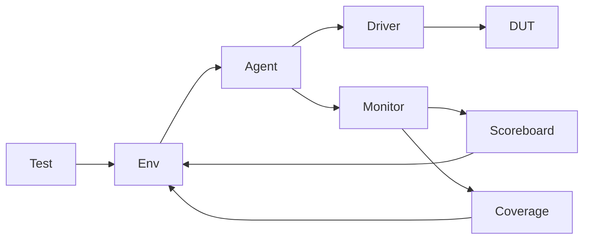

# SPI UVM Environment Documentation

## 📌 Overview
O `spi_env` é o container top-level do ambiente de verificação UVM, responsável por:
- Instanciar e conectar todos os componentes UVM
- Configurar o modo de operação do sistema
- Gerenciar a cobertura e verificação funcional
- Prover interfaces para configuração do teste

## 🧩 Componentes do Ambiente
| Componente     | Descrição                                  |
|----------------|--------------------------------------------|
| `agent`        | Agente UVM com driver/monitor/sequencer    |
| `scoreboard`   | Verificador de integridade de dados        |
| `coverage`     | Coletor de cobertura funcional            |

## ⚙️ Configuração do Ambiente
### Parâmetros Principais
| Parâmetro    | Tipo | Valores         | Efeito                          |
|-------------|------|-----------------|---------------------------------|
| `is_active` | bit  | UVM_ACTIVE(1)   | Habilita componentes ativos     |
|             |      | UVM_PASSIVE(0)  | Modo somente monitoração        |
| `mode`      | bit  | 0 (Slave)       | Configura modo de operação      |
|             |      | 1 (Master)      |                                 |

### Métodos de Configuração
```systemverilog
// Exemplo de uso no teste
class my_test extends uvm_test;
    task run_phase(uvm_phase phase);
        spi_env env;
        
        // Configuração dinâmica
        env.set_active(UVM_ACTIVE);
        env.set_mode(1); // Master mode
    endtask
endclass
```
## 📋 Código Principal
### Estrutura do Ambiente
```systemverilog
class spi_env extends uvm_env;
    spi_agent       agent;      // Componente de comunicação
    spi_scoreboard  scoreboard; // Verificador de dados
    spi_coverage    coverage;   // Métricas de cobertura
    
    // Configurações
    bit is_active = UVM_ACTIVE;
    bit mode;  // Modo de operação
endclass
```
### Fluxo de Construção

### Conexão de Componentes
```systemverilog
virtual function void connect_phase(uvm_phase phase);
    // Conexão do agent com verificadores
    agent.analysis_port.connect(scoreboard.analysis_export);
    agent.analysis_port.connect(coverage.analysis_export);
endfunction
```
## 🔄 Fluxo de Operação

## 💡 Casos de Uso Comuns
### 1. Configuração Master Ativo
```systemverilog
function void my_test::build_phase(uvm_phase phase);
    super.build_phase(phase);
    env = spi_env::type_id::create("env", this);
    env.set_active(UVM_ACTIVE);
    env.set_mode(1);
endfunction
```
### 2. Modo Passivo para Monitoração
```systemverilog
env.set_active(UVM_PASSIVE);  // Desativa driver e sequencer
```
### 3. Conexão de Múltiplos Agents
```systemverilog
// Para sistemas multi-SPI
agent_master.analysis_port.connect(scoreboard.analysis_export);
agent_slave.analysis_port.connect(scoreboard.analysis_export);
```
## 🚦 Saída Esperada
```log
UVM_INFO spi_env.sv(42) @ 1.2ms: ENV [ENV] Coverage Final: 92.34%
UVM_INFO spi_scoreboard.sv(67) @ 1.2ms: SCOREBOARD [SB] All transactions matched (50/50)
```
## 🛠 Extensibilidade
### Adicionando Novos Componentes
#### 1. Crie novos componentes UVM
#### 2. Instancie no build_phase
```systemverilog
virtual function void build_phase(uvm_phase phase);
    super.build_phase(phase);
    my_component = my_component::type_id::create("my_component", this);
endfunction
```
#### 3. Conecte na connect_phase
```systemverilog
virtual function void connect_phase(uvm_phase phase);
    agent.analysis_port.connect(my_component.analysis_export);
endfunction
```
