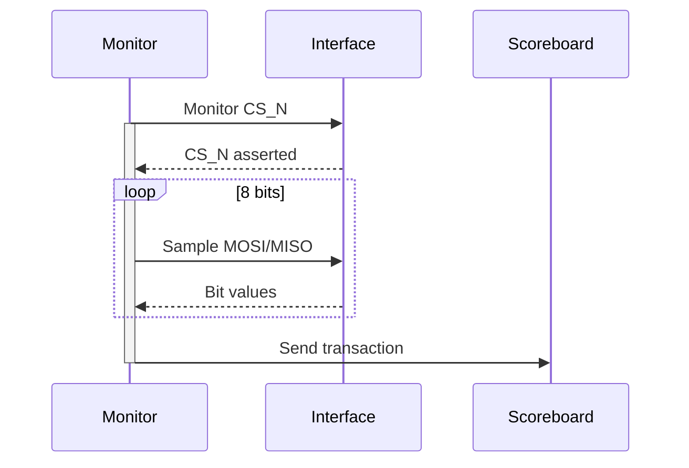

# SPI UVM Monitor Documentation

## 📌 Monitor Overview
Componente UVM responsável por observar e capturar transações SPI diretamente da interface, verificando o comportamento do DUT em tempo real.

### Key Features
- 🕵️ Captura automática de transações MOSI/MISO
- ⏱ Sincronização com modo Master/Slave
- 🔀 Suporte a MSB/LSB first
- 📊 Coleta de métricas de temporização
- 🔍 Detecção de erros de protocolo

## 📋 Monitor Components

### Main Methods
| Método               | Função                                  |
|----------------------|-----------------------------------------|
| `capture_transaction`| Coordena todo o processo de captura    |
| `wait_for_start`     | Detecta início da transação (CS_N low) |
| `collect_data`       | Coleta 8 bits de dados                 |
| `sample_master_bits` | Amostragem no modo Master              |
| `sample_slave_bits`  | Amostragem no modo Slave               |

### Operation Flow

## 🛠 Integration Code
```systemverilog
// No environment
spi_monitor monitor;

// Conexão da interface
uvm_config_db#(virtual spi_interface.monitor)::set(null, "*.monitor", "vif", intf);

// Conexão do analysis port
monitor.mon_ap.connect(scoreboard.mon_export);
```
## 📊 Example Output
```log
UVM_INFO spi_monitor.sv(127) @ 1.2us: MONITOR [SPI_MON] 
Captured Transaction:
{
  mode       : MASTER
  lsb_first  : 0
  data       : 8'hA5
  recv_data  : 8'hC3
  duration   : 1.1us
}
```
