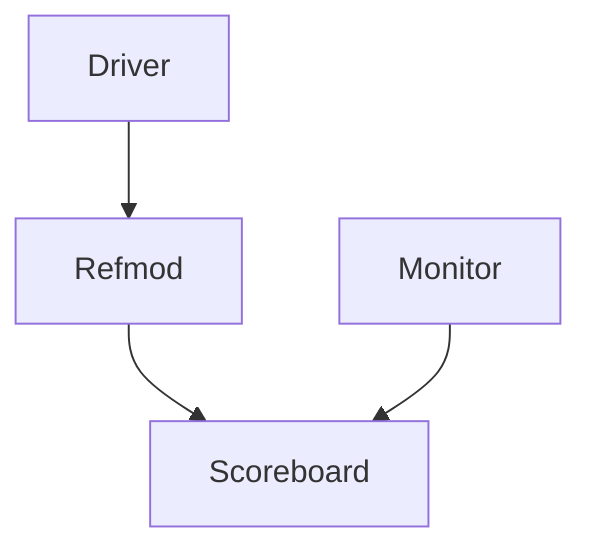

# SPI Reference Model Documentation

## 📌 Overview
O `spi_refmod` implementa o modelo de referência para o protocolo SPI, gerando transações esperadas baseadas no comportamento ideal do DUT.

## 🧩 Funcionalidades
- Modelagem precisa do protocolo SPI
- Geração de transações esperadas
- Suporte a modos Master/Slave
- Simulação do comportamento do hardware

## ⚙️ Diagrama de Funcionamento

