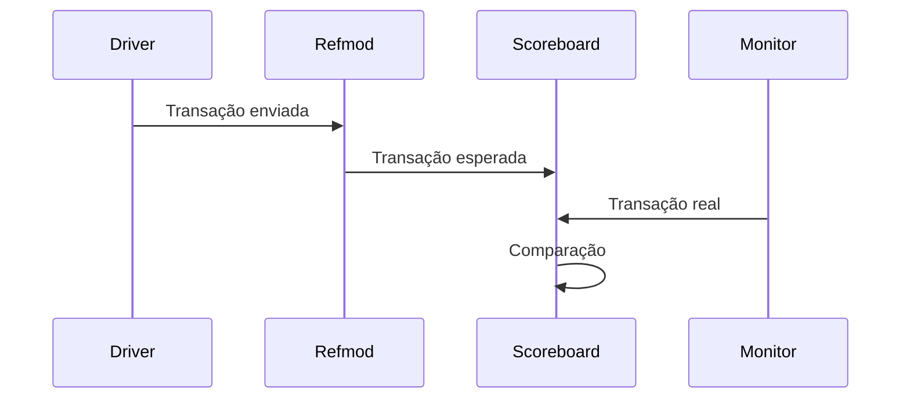
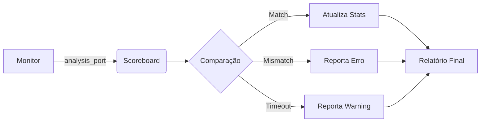

# SPI UVM Scoreboard Documentation

## 📌 Overview
O `spi_scoreboard` é o componente responsável pela verificação funcional do DUT SPI, comparando transações observadas com transações esperadas e garantindo a integridade do protocolo.

## 🧩 Funcionalidades Principais
- ✅ Comparação TX/RX em tempo real
- ✅ Verificação de temporização
- ✅ Detecção de transações perdidas/inesperadas
- ✅ Geração de relatórios de verificação
- ✅ Suporte a modo Master/Slave
- ✅ Controle de enable/disable de checagens

## ⚙️ Diagrama de Funcionamento

## 📋 Estrutura do Código
### Portas de Comunicação
```systemverilog
uvm_analysis_imp #(spi_transaction, spi_scoreboard) analysis_export;
```
### Métodos Principais
# Métodos Principais do SPI Scoreboard

A tabela abaixo descreve os principais métodos implementados no componente `spi_scoreboard`:

| **Método**               | **Descrição**                                                                 | **Parâmetros**                     |
|--------------------------|-----------------------------------------------------------------------------|------------------------------------|
| `write_mon()`            |Recebe transações do monitor                                                    | `spi_transaction tr`               |
| `write_refmod()`         | Recebe previsões do refmod                                                     | `spi_transaction tr`               |
| `compare_transactions()` | Compara transação monitorada com a esperada (dados + timing)                | `actual`: DUT<br>`expected`: Modelo |
| `get_report()`           | Gera relatório final com estatísticas de verificação                       | -                                  |
| `add_expected()`         | Adiciona transação à fila de esperados para comparação futura               | `spi_transaction tr`               |
| `build_phase()`          | Fase UVM de construção (obtém interface virtual)                            | `uvm_phase phase`                  |
| `report_phase()`         | Gera relatório final com métricas de sucesso/erro                          | `uvm_phase phase`                  |

## Detalhes de Implementação
```systemverilog
// Exemplo de uso dos métodos
virtual function void write(spi_transaction tr);
    // Lógica de recebimento de transação
endfunction

virtual function void compare_transactions(
    spi_transaction actual, 
    spi_transaction expected
);
    // Lógica de comparação
endfunction
```
## 🔄 Fluxo de Dados

## 💡 Casos de Uso
### 1. Verificação Básica
```systemverilog
// Na sequência
task body();
    spi_transaction tr;
    tr = spi_transaction::type_id::create("tr");
    tr.data = 8'hA5;
    tr.clock_div = 4;
    
    // Adiciona esperado
    scb.add_expected(tr);
    
    // Envia para driver
    start_item(tr);
    finish_item(tr);
endtask
```
### 2. Desabilitar Checagens
```systemverilog
// No teste
scoreboard.enable_checks = 0;  // Desativa verificações
```
### 3. Verificação de Timing
```systemverilog
// Transação esperada
tr.clock_div = 4;  // Define tempo máximo: 4 * 20ns = 80ns
```

## 🚦 Saída de Exemplo
```log
UVM_INFO spi_scoreboard.sv(78) @ 1200ns: SCBD [SCBD] 
Resumo da Verificação:
Transações verificadas: 50
Erros encontrados:      2
Taxa de sucesso:        96.00%
```
## 🛠 Integração com Ambiente
### 1. Conexão no Ambiente
```systemverilog
function void spi_env::connect_phase(uvm_phase phase);
    agent.analysis_port.connect(scoreboard.analysis_export);
endfunction
```
### 2. Configuração de Interface
```systemverilog
// No testbench
uvm_config_db#(virtual spi_interface)::set(null, "*.scoreboard", "vif", intf);
```

## 🚨 Debug Comum
# Debug Comum do SPI Scoreboard

## 🚨 Tabela de Diagnóstico Rápido

| **Sintoma**               | **Causa Provável**               | **Solução**                          |
|---------------------------|-----------------------------------|---------------------------------------|
| Transações não verificadas| Scoreboard desabilitado           | `enable_checks = 1`                  |
| Dados TX/RX inconsistentes| Modo (Master/Slave) incorreto     | Verificar `mode` do Agent            |
| Transações inesperadas    | Fila de esperados vazia           | Checar sequenciador/add_expected     |
| Erros de temporização     | `clock_div` não configurado       | Definir `clock_div` nas transações   |
| Sem transações recebidas  | Conexão do monitor incorreta      | Verificar `analysis_port.connect()`  |
| Múltiplos erros consec.   | Reset não tratado                 | Checar sinal `reset_n` no DUT        |

## 🔍 Guia de Uso da Tabela
1. Identifique o sintoma na coluna da esquerda
2. Verifique as causas prováveis correspondentes
3. Aplique a solução sugerida

```systemverilog
// Exemplo de correção para enable_checks
scoreboard.enable_checks = 1; // Reativa verificações
```
