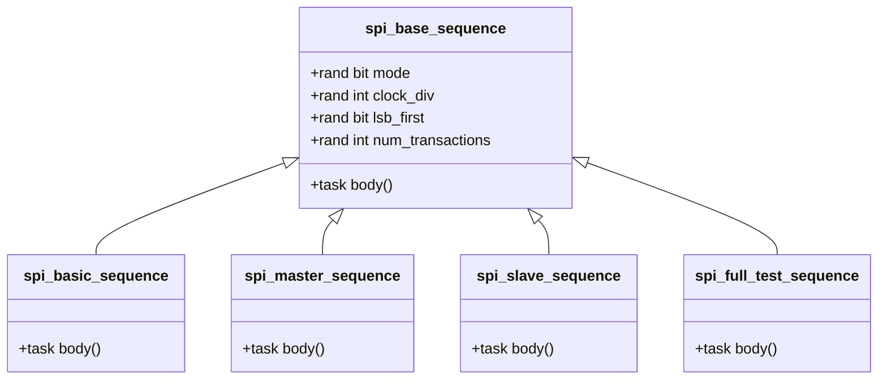

# UVM SPI Sequences Documentation

## 📌 Visão Geral
Este documento explica as sequências UVM implementadas para testar o controlador SPI, incluindo diferentes modos de operação e cenários de teste.

## 🧩 Tipos de Sequências
| Sequência                 | Descrição                                  |
|---------------------------|-------------------------------------------|
| `spi_base_sequence`       | Classe base para todas as sequências      |
| `spi_basic_sequence`      | Teste básico com transações aleatórias    |
| `spi_master_sequence`     | Teste focado no modo Master               |
| `spi_slave_sequence`      | Teste focado no modo Slave                |
| `spi_full_test_sequence`  | Sequência completa com múltiplos cenários |

## ⚙️ Configuração de Sequências
### Parâmetros Comuns
```systemverilog
rand bit mode;          // 0: Slave, 1: Master
rand int clock_div;     // Divisor de clock (1-31)
rand bit lsb_first;     // Ordem dos bits
rand int num_transactions; // Número de transações
```
## Exemplo de Uso
```systemverilog
class my_test extends uvm_test;
    task run_phase(uvm_phase phase);
        spi_master_sequence master_seq;
        spi_slave_sequence slave_seq;
        
        master_seq = spi_master_sequence::type_id::create("master_seq");
        slave_seq = spi_slave_sequence::type_id::create("slave_seq");
        
        // Executa sequência Master
        master_seq.start(env.agent.sequencer);
        
        // Executa sequência Slave
        slave_seq.start(env.agent.sequencer);
    endtask
endclass
```
## 📋 Diagrama de Hierarquia

## 🚦 Exemplo de Saída
```log
UVM_INFO @ 0ns: SEQ [SEQ] Iniciando sequência Master
UVM_INFO @ 120ns: DRIVER [SPI_DRV] Transação iniciada: data=0xA5, mode=MASTER
UVM_INFO @ 240ns: MONITOR [SPI_MON] Transação completada: TX=0xA5 RX=0x5A
```
## 💡 Melhores Práticas
### 1. Reutilização de Sequências:
```systemverilog
virtual task body();
    spi_basic_sequence basic_seq;
    basic_seq = spi_basic_sequence::type_id::create("basic_seq");
    basic_seq.num_transactions = 20;
    basic_seq.start(sequencer);
endtask
```
### 2. Randomização Controlada:
```systemverilog
`uvm_do_with(req, {
    data inside {[8'h00:8'h0F]};  // Testa primeiros 16 valores
    clock_div == 2;               // Clock fixo
})
```
### 3. Sequências Hierárquicas:
```systemverilog
virtual task body();
    // Executa múltiplas sequências
    `uvm_do(spi_master_sequence::get_type())
    `uvm_do(spi_slave_sequence::get_type())
endtask
```
## 🛠 Extensibilidade
### Crie novas sequências herdando da classe base:
```systemverilog
class spi_error_sequence extends spi_base_sequence;
    `uvm_object_utils(spi_error_sequence)
    
    virtual task body();
        // Gera transações com erros propositais
        `uvm_do_with(req, {data == 8'hFF; clock_div == 0;})
    endtask
endclass
```
