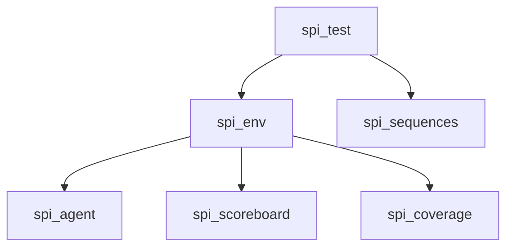

# UVM SPI Test Documentation

## Overview
This document explains the test infrastructure for verifying the SPI controller using UVM, including test setup, execution flow, and result analysis.

## Test Architecture

## Key Features
* Multi-scenario Testing: Supports basic/full test modes
* Coverage Control: Configurable coverage collection
* Automatic Reporting: Generates test summary with key metrics
* Flexible Configuration: Runtime test parameterization
## Test Types
|Test Class | Description|
|------------|---------|
|`spi_test` | 	Base test class with common infrastructure|
|`spi_basic_test` | 	Runs basic transaction sequence|
|`spi_full_test` | 	Executes comprehensive test scenarios|
|`spi_mode_test` | 	Focused mode testing (Master/Slave)|

## Execution Flow
```mermaid
sequenceDiagram
    Test->>+Env: build_phase()
    Test->>Env: configure_parameters()
    Test->>+Env: run_phase()
    Env->>Sequencer: start_sequence()
    Sequencer->>Driver: execute_transactions()
    Driver->>DUT: stimulate_signals()
    Monitor->>Scoreboard: capture_results()
    Scoreboard->>Test: update_metrics()
    Test->>-Env: test_complete()
```
